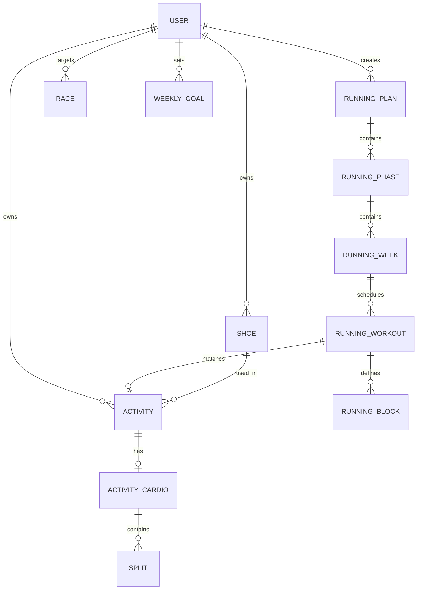

# OpenRunning — Master Plan de Arquitectura y Desarrollo

> **OpenRunning** es una plataforma open-source, self-hosted y privacy-first diseñada específicamente para corredores (desde 5K hasta Maratón y Trail), inspirada en la filosofía de **openGym** pero con una arquitectura moderna, tipada y escalable basada en la solidez técnica de **ATOS**.

---

## 1. Visión y Propósito del Producto

### 1.1 El Problema
Las aplicaciones de running actuales (Strava, TrainingPeaks, Nike Run Club, Garmin Connect) presentan al menos uno de los siguientes problemas:
1. **Ecosistemas cerrados y suscripciones predatorias:** Métricas clave (como análisis de intervalos, tendencias de fatiga o planes estructurados) están bloqueadas tras paywalls mensuales.
2. **Falta de soberanía de datos:** Los datos de salud y ubicación GPS residen en servidores de terceros.
3. **Desconexión entre plan y ejecución:** O bien tienes una app de mapas y red social (Strava), o una app de planes rígida (TrainingPeaks), sin una experiencia integrada, moderna y visual que priorice la vista semanal del corredor.

### 1.2 La Propuesta de OpenRunning
* **Self-hosted & Local-friendly:** Desplegable en tu propio servidor o Docker local con un solo comando.
* **Foco 100% en Running:** Todo el modelo de datos, la terminología y las pantallas están pensados para corredores: bloques de series, ritmos (min/km), zonas cardíacas, VDOT, carga semanal y control de zapatillas.
* **Modelo Dual de Registro (Automático con Strava + Manual In-App):**
  * **Sincronización con Strava (heredada de ATOS):** Conexión OAuth2 con importación automática de actividades de carrera, mapas GPS (polilíneas para Leaflet), elevación, frecuencia cardíaca, cadencia, splits por km y botón de sincronización manual bajo demanda desde el dashboard.
  * **Registro Manual In-App:** Flujo rápido para corredores sin reloj GPS o que no usan Strava. Permite ingresar distancia, tiempo, sensaciones (RPE 1-10), zapatilla utilizada y vincular la carrera directamente a la sesión del plan semanal.
  * **Importador de archivos:** Carga directa de archivos `.fit` y `.gpx`.
* **Herramientas para el Atleta:** Calculadoras VDOT (Jack Daniels), predictores de carrera, alertas de desgaste de calzado y motor de planes estructurados.
* **Inteligencia Asistida (AI Coach / MCP):** Servidor MCP para que asistentes de IA (Claude, Cursor, Antigravity) puedan analizar tu historial, fatiga y planes en tiempo real.

### 1.3 Repositorios de Referencia Locales

Para acelerar el desarrollo y mantener coherencia arquitectónica y de UX, este proyecto toma como referencia directa dos repositorios hermanos ubicados en el entorno local:

1. **ATOS (`atos-app`):**
   * **Ruta local:** [`/home/jose/Documentos/Proyectos/atos-app`](file:///home/jose/Documentos/Proyectos/atos-app)
   * **Propósito de referencia:** Arquitectura backend estructurada (FastAPI + SQLModel + PostgreSQL + Alembic), integración con Strava OAuth2, cliente OpenAPI tipado (`@hey-api/openapi-ts`), sistema de design tokens (`tokens.json`), componentes con Radix UI / Tailwind CSS v4, y los modelos de datos de running ya existentes (`RunningPlan`, `RunningPhase`, `RunningWeek`, `RunningWorkout`, `RunningBlock`, `Shoe`, `Race`).
   
2. **openGym (`opengym`):**
   * **Ruta local:** [`/home/jose/Documentos/Proyectos/opengym`](file:///home/jose/Documentos/Proyectos/opengym)
   * **Propósito de referencia:** Ergonomía de UX táctil mobile-first (bottom sheets, steppers táctiles de incremento/decremento, timers flotantes), empaquetado móvil PWA con Capacitor (`@capacitor/*`), arquitectura del servidor MCP (`mcp/`) para el AI Coach, y la disciplina de testing unitario de lógica deportiva pura aislada en `lib/` con Vitest.

---

## 2. Decisiones de Arquitectura y Stack Tecnológico

Basado en la evaluación comparativa entre **ATOS** y **openGym**, OpenRunning adoptará lo mejor de ambos mundos: **la solidez arquitectónica, tipado y base de datos relacional de ATOS**, combinado con **el diseño táctil mobile-first, pruebas de lógica pura y las capacidades MCP/Capacitor de openGym**.

```
                           ┌────────────────────────────────────────┐
                           │            OPENRUNNING APP             │
                           └────────────────────────────────────────┘
                                               │
             ┌─────────────────────────────────┴─────────────────────────────────┐
             ▼                                                                   ▼
┌───────────────────────────────┐                                   ┌───────────────────────────────┐
│     Frontend (Web & PWA)      │                                   │       Backend API & Data      │
├───────────────────────────────┤                                   ├───────────────────────────────┤
│ • React 19 + TypeScript       │                                   │ • Python 3.12+ (FastAPI)      │
│ • Vite + Bun                  │                                   │ • SQLModel / SQLAlchemy 2.0   │
│ • Tailwind CSS v4 + Tokens    │                                   │ • PostgreSQL 16               │
│ • Radix UI / Shadcn Primitives│ ◄──────── OpenAPI Spec ─────────► │ • Alembic (Migraciones)       │
│ • TanStack Router & Query     │      (hey-api/openapi-ts)         │ • JWT Auth + OAuth2 (Strava)  │
│ • Leaflet (Mapas GPS)         │                                   │ • Background Sync Workers     │
│ • Capacitor (iOS/Android PWA) │                                   │ • MCP Server (AI Coach Bridge)│
└───────────────────────────────┘                                   └───────────────────────────────┘
```

### 2.1 Frontend
* **Core:** React 19, TypeScript estricto, Vite, Bun como runtime y package manager.
* **Enrutamiento:** TanStack Router (enrutamiento basado en archivos con seguridad de tipos en compilación).
* **Gestión de Estado y Servidor:** TanStack Query v5 + Cliente API autogenerado desde OpenAPI.
* **Estilos y Componentes:** Tailwind CSS v4, sistema de Design Tokens (`tokens.json`), Radix UI primitives, Lucide Icons.
* **Visualización de Datos:** Gráficos SVG ligeros y custom para ritmos/splits, mapas interactivos con Leaflet.
* **Mobile / PWA:** Configuración de Service Worker para PWA y contenedor opcional con Capacitor (`@capacitor/core`, `@capacitor/local-notifications`).

### 2.2 Backend
* **Framework:** FastAPI (Python 3.12+), aprovechando su rendimiento asíncrono, OpenAPI nativo y validación estricta con Pydantic v2.
* **Persistencia:** PostgreSQL con SQLModel (soporte nativo para consultas relacionales complejas, series temporales y geodatos).
* **Migraciones:** Alembic para evolución de esquema sin pérdida de datos.
* **Sincronización:** Webhook y OAuth2 para Strava API; lector de archivos FIT/GPX (`fitparse`, `gpxpy`).
* **AI Bridge (MCP):** Servidor MCP compatible con el protocolo Anthropic/ModelContextProtocol para lectura contextual de planes y métricas por LLMs.

---

## 3. Modelo de Dominio de Running (Core Domain)

A diferencia del dominio de gimnasio (ejercicios, series, kilos), el dominio de OpenRunning se estructura en torno a las siguientes entidades clave:



### 3.1 Jerarquía de Entidades

1. **Planes de Entrenamiento (`RunningPlan`):**
   * **Fases (`RunningPhase`):** Base, Construcción, Específica, Tapering, Recuperación.
   * **Semanas (`RunningWeek`):** Número de semana relativa, kilometraje objetivo, foco semanal.
   * **Sesiones Programadas (`RunningWorkout`):** Fecha, tipo (Rodaje Z2, Intervalos, Tempo, Tirada Larga, Descanso), descripción, estado (pendiente, completada, omitida).
   * **Bloques de Sesión (`RunningBlock`):**
     * Tipo: `warmup`, `work_interval`, `recovery_interval`, `cooldown`, `steady`.
     * Criterio: Por distancia (ej. 1000m) o tiempo (ej. 4 min).
     * Intensidad objetivo: Ritmo objetivo (ej. `4:15 - 4:20 min/km`), Zona cardíaca (ej. `Z4: 165-175 bpm`), o RPE (1-10).
     * Repeticiones: soporte de agrupaciones (ej. 6 $\times$ 1000m / 90s trote).

2. **Actividades Realizadas (`Activity` & `ActivityCardio`):**
   * **Origen de Datos (`source`):** `'strava' | 'manual' | 'fit_file' | 'gpx_file'` (permite coexistencia transparente entre sincronizaciones automáticas de Strava y registros manuales directos).
   * **Metadatos:** Distancia total, tiempo transcurrido, tiempo en movimiento, ritmo medio, desnivel (+/-), calorías, cadencia media.
   * **Frecuencia Cardíaca:** FC media, FC máxima, tiempo en Z1-Z5.
   * **Mapa y Trazado:** Polyline codificada (Leaflet), elevación por punto (disponible en actividades sincronizadas con GPS).
   * **Splits:** Parciales por kilómetro o milla con ritmo, desnivel y FC.
   * **Sensaciones & RPE:** Escala de esfuerzo percibido (1 al 10) y notas subjetivas post-carrera.
   * **Vinculación:** Zapatilla utilizada (`Shoe`) y sesión programada asociada (`RunningWorkout`).

3. **Herramientas y Seguimiento:**
   * **Calzado (`Shoe`):** Marca, modelo, fecha de estreno, kilometraje acumulado, límite recomendado (ej. 700 km), estado (activa, retirada).
   * **Carreras y Eventos (`Race`):** Nombre, fecha, distancia oficial, tiempo objetivo, tiempo logrado, cuenta regresiva, prioridad (A, B, C).
   * **Métricas VDOT / Jack Daniels:** VDOT actual estimado según mejor marca reciente, tablas de ritmos de entrenamiento (Easy, Marathon, Threshold, Interval, Repetition).

---

## 4. Mapa de Pantallas y Funcionalidades (UX / UI)

Inspirado en la ergonomía táctil de openGym pero implementado con Tailwind CSS v4 y Radix UI:

### 4.1 Dashboard Semanal / Home (`/`) — Fiel a openGym adaptado a Running
Diseñado siguiendo la estructura visual y ergonomía táctil de `Home.jsx` de openGym (tarjetas contenidas, tira superior de 7 días, tipografía de impacto y navegación táctil en un solo toque):

* **Cabecera (`Header`):**
  * Saludo personalizado (`¡Hola, {nombre}!`), fecha en formato extendido (`martes, 15 de septiembre`) y acceso directo a Configuración (`gear icon`).
* **Barra de Sincronización y Acciones Rápidas (Strava & Quick Log):**
  * **Estado de Conexión Strava:** Badge en tiempo real con el estado de sincronización (ej. `"Strava sincronizado · hace 15m"` o indicador de progreso `"Sincronizando..."`).
  * **Botón `Sync Strava`:** Botón con ícono de refresco para forzar la sincronización manual inmediata con Strava desde el dashboard (idéntico al funcionamiento de ATOS).
  * **Botón `+ Registrar Manual`:** Acceso directo para abrir el drawer `ManualRunSheet` y cargar una carrera sin depender de reloj GPS o Strava.
* **Tarjeta Principal: Tira Semanal y Sesión de Hoy (equivalente al Week Strip + Today Row de openGym):**
  * **Navegación semanal:** Selector superior con flechas `< Esta semana >` para consultar semanas previas o futuras.
  * **Tira interactiva de 7 días (L M M J V S D):** Cada día muestra su nombre corto, día del mes y punto de estado (`dot`):
    * `dot done` (verde/esmeralda): Sesión de carrera completada (sea por Strava o registro manual).
    * `dot plan` (teal/acento): Sesión programada en el plan para ese día.
    * `dot ovr` (ámbar): Sesión reprogramada o ajustada manualmente.
    * Indicador `today`: Día actual resaltado. Al tocar cualquier día se abre el drawer para inspeccionar o reprogramar la sesión.
  * **Fila "Hoy" (`Today Row`):** Justo debajo de la tira semanal dentro de la misma tarjeta:
    * Ícono circular temático con color de dominio (fuego para series/intervalos, cronómetro para ritmo controlado, zapatilla para rodaje suave, luna para descanso).
    * Subtítulo "Hoy" + Título de la sesión (ej. `8x1000m a 4:10/km`, `Rodaje Regenerativo 8K` o `Día de Descanso`).
    * Tag interactivo a la derecha: `Ver sesión`, `+ Registrar`, `Cumplida ✓` o botón destacado de acción rápida.
* **Tarjeta de Próxima Carrera Objetivo (Target Race Countdown):**
  * Tarjeta de prioridad alta en el Home dedicada a la carrera principal:
    * Nombre oficial del evento (ej. *"Media Maratón de Buenos Aires"*).
    * Contador gigante de días restantes con badge visual destacado (ej. `"Faltan 38 días"`).
    * Datos clave del objetivo: Distancia (`21.1 km`), Fecha (`24 Ago 2025`), Objetivo de tiempo (`Sub-1:45:00`), Ritmo de paso necesario (`4:58 min/km`).
    * Enlace directo a la nueva pantalla de **Carreras** (`/carreras`).
* **Tarjeta de Volumen Semanal & Racha (equivalente a Streak / Workouts de openGym):**
  * Racha activa de semanas consecutivas corriendo con ícono de fuego 🔥 (`"12 semanas de racha"`).
  * Progreso de kilometraje semanal: Barra visual de km recorridos vs. meta semanal (ej. `34.2 / 50.0 km · 68%`).
  * Días activos: `3 de 4 sesiones completadas esta semana`.
  * Al tocar la tarjeta se abre el calendario mensual completo en modal/sheet.
* **Tarjeta de AI Coach (`CoachCard` — idéntica a openGym):**
  * Se muestra únicamente cuando el entrenador IA tiene una propuesta o análisis pendiente (ej. *"Tu plan de descarga para la semana 6 está listo"* o *"Sugerencia: reducir 3 km el rodaje del jueves por fatiga acumulada"*).
* **Tarjeta de Estado de Zapatillas (Quick Glance):**
  * Visualización rápida del par principal activo con su barra de desgaste (ej. `Nike Pegasus 40 · 520 / 700 km · 74%`).

### 4.2 Visor de Actividades y Registro Manual (`/activities`)
* **Detalle de Actividad con GPS (Sincronizada vía Strava o Archivo FIT/GPX):**
  * Mapa interactivo completo con selector de capas y trazado Leaflet con heatmap por ritmo.
  * Gráfico interactivo sincronizado con el cursor del mapa: Ritmo vs. Elevación vs. Frecuencia Cardíaca.
  * Tabla de Splits (km a km) con indicación visual de ritmos rápidos vs. lentos.
  * Comparativa automática contra el plan: "¿Qué estaba planificado?" vs "¿Qué se corrió en realidad?".
* **Drawer / Modal de Registro Manual (`ManualRunSheet` — ergonomía táctil openGym):**
  * Formulario táctil optimizado para móvil con steppers (`+`, `-`) para uso inmediato post-carrera:
    * Fecha y hora del entrenamiento.
    * Distancia en kilómetros (steppers rápidos de $\pm 0.1$ km y $\pm 1.0$ km).
    * Tiempo total (hh:mm:ss) y Ritmo medio (min/km), con recálculo bidireccional automático en tiempo real.
    * Esfuerzo percibido (escala RPE del 1 al 10 con badges de intensidad: "Muy suave", "Z2 Cómodo", "Umbral", "Máximo").
    * Selector de zapatillas del atleta para computar el desgaste de kilometraje.
    * Selector para vincular la carrera a la sesión planificada del día (marcando el plan semanal como cumplido).
    * Campo de notas y sensaciones post-entreno (clima, sensaciones físicas, terreno).

### 4.3 Gestor de Planes (`/plans`)
* Visualizador de planes activos y archivo de planes pasados.
* Editor de sesiones: Modal o drawer táctil para construir intervalos con sumador rápido (`+`, `-`) de distancia y ritmos objetivo.
* Catálogo de planes predefinidos (Seed):
  * Plan 5K Principiante.
  * Plan 10K Sub-50 y Sub-60.
  * Plan Media Maratón (21K) Sub-1:45.
  * Plan Maratón (42K) Introductorio.

### 4.4 Calculadoras del Corredor (`/tools`)
* **Calculadora VDOT:** Introduce una marca reciente (ej. 10K en 48:30) y calcula automáticamente tus ritmos de entrenamiento exactos.
* **Predictor de Carrera:** Estimación de tiempos en 5K, 10K, 21K y 42K según la fórmula de Riegel y Daniels.
* **Conversor de Ritmos:** Tablas interactivas min/km $\leftrightarrow$ km/h $\leftrightarrow$ min/milla.

### 4.5 Zapatillas (`/shoes`)
* Tarjetas de cada par de zapatillas con barra de progreso de kilometraje y colores según estado (verde $<70\%$, amarillo $70-90\%$, rojo $>90\%$).
* Asignación automática o manual de zapatilla por defecto según tipo de sesión (ej. rodaje diario vs. zapatillas de placa de carbono para series y carreras).

### 4.6 Gestor de Carreras y Objetivos (`/carreras` o `/races`)
Pantalla dedicada integral para planificar la temporada competitiva, agendar eventos y registrar el palmarés del corredor:
* **Carrera Principal Destacada (A-Race Hero):** Banner superior con la carrera objetivo principal, cuenta regresiva regresiva en vivo, altimetría, estrategia de splits por km y plan de entrenamiento vinculado.
* **Calendario de Próximas Carreras:**
  * Listado cronológico de carreras en las que el atleta está inscripto o proyecta correr.
  * Clasificación por prioridad competitiva:
    * **Prioridad A:** Objetivo cumbre de la temporada (define el ciclo de entrenamiento y descarga).
    * **Prioridad B:** Carreras preparatorias o tests de ritmo competitivo (ej. 10K a ritmo fuerte 4 semanas antes de un 21K).
    * **Prioridad C:** Carreras recreativas, de fondo social o entrenamientos con dorsal.
  * Ficha detallada por carrera:
    * Nombre oficial, ciudad/locación y fecha/hora de largada.
    * Distancia oficial (5K, 10K, 15K, 21.1K Media Maratón, 42.2K Maratón, Trail con desnivel positivo D+).
    * Objetivos de tiempo (Objetivo A ideal, Objetivo B realista) y ritmo medio requerido (min/km).
    * Pronóstico de tiempo calculado según el VDOT actual del atleta.
    * Datos logísticos: Número de dorsal (Bib number), oleada/corral de largada, estado de inscripción (confirmada, pendiente de pago, lista de espera), costo y enlace oficial del evento.
* **Historial de Carreras Completadas & Récords Personales (PRs):**
  * Historial histórico con tiempos oficiales de la organización y tiempos chip (tiempo neto).
  * Ritmo medio real, posición general y posición por categoría/edad.
  * Vinculación automática con la actividad registrada en Strava / GPX.
  * Zapatilla utilizada en el evento.
  * Badges de Récord Personal (PR) destacados automáticamente para distancias estándar (5K, 10K, 15K, 21K, 42K).
* **Modal / Drawer de Carrera (`CarreraSheet`):** Formulario rápido táctil para agendar una nueva carrera con autocompletado de ritmos objetivo según VDOT o registrar los resultados finales.

### 4.7 AI Coach & MCP
* Conector MCP local para que el corredor pueda abrir Claude Desktop o Cursor y preguntar:
  * *"¿Cómo fue mi progresión de volumen en las últimas 4 semanas?"*
  * *"Según mi fatiga y mi carrera en 3 semanas, ¿debo ajustar la tirada larga del domingo?"*

---

## 5. Fases de Ejecución y Hoja de Ruta (Roadmap)

### Fase 1: Inicialización del Repositorio y Arquitectura Base (Semana 1)
- [ ] Inicializar la estructura monorepo en `/home/jose/Documentos/Proyectos/openrunning`:
  - `frontend/`: React 19, TypeScript, Vite, Tailwind CSS v4, Biome/ESLint.
  - `backend/`: FastAPI, SQLModel, Alembic, Poetry/uv.
  - `docker-compose.yml`: PostgreSQL + API + Frontend + Traefik/Nginx.
- [ ] Configurar el pipeline de diseño de tokens y paleta temática (estilo deportivo oscuro/claro).
- [ ] Configurar OpenAPI TypeScript Client Generation (`@hey-api/openapi-ts`).

### Fase 2: Modelado de Datos y Backend Core (Semana 2)
- [ ] Implementar modelos SQLModel para Usuarios, Actividades, Splits, Planes, Fases, Sesiones, Bloques, Zapatillas y Carreras.
- [ ] Crear migraciones iniciales de Alembic.
- [ ] Endpoints CRUD base con autenticación JWT segura.
- [ ] Tests de modelos y servicios con `pytest`.

### Fase 3: Ingesta de Actividades — Strava Sync & Registro Manual (Semana 3)
- [ ] Integración completa con Strava API (OAuth2 flow, webhook de actividades nuevas, refresh de tokens y sincronización manual on-demand).
- [ ] Endpoints de Backend para Registro Manual de Carreras (creación directa de actividades con distancia, tiempo, RPE y zapatillas).
- [ ] Parser de archivos `.fit` y `.gpx` para subida de tracks GPS sin depender de plataformas de terceros.
- [ ] Servicio de cálculo de métricas de running (ritmos medios, splits, zonas cardíacas, desniveles acumulados).

### Fase 4: Frontend — Vistas de Actividades, Dashboard y Registro Manual (Semana 4)
- [ ] Layout principal responsive con navegación tipo app móvil (bottom bar en móvil, sidebar en desktop).
- [ ] Dashboard semanal fiel a openGym con tira semanal interactiva, fila "Hoy", racha y card de próxima carrera.
- [ ] Barra de estado de Strava con botón de sincronización manual inmediata y botón `+ Registrar Manual`.
- [ ] Drawer táctil `ManualRunSheet` con steppers rápidos (`+`, `-`) para carga de carreras en segundos.
- [ ] Componente de Mapa Leaflet con renderizado de polilínea coloreada por ritmo y tabla de splits.
- [ ] Vista de detalle de actividad.

### Fase 5: Motor de Planes y Editor de Intervalos (Semana 5)
- [ ] Vista jerárquica de plan de entrenamiento (Fases $\rightarrow$ Semanas $\rightarrow$ Días).
- [ ] Editor interactivo de bloques de sesión (Calentamiento, Series, Recuperaciones, Enfriamiento).
- [ ] Motor de matching automático: vincular automáticamente una actividad real con la sesión programada del día.

### Fase 6: Herramientas del Corredor, Carreras y Zapatillas (Semana 6)
- [ ] Implementar la suite de funciones puras en `frontend/src/lib/running-math.ts` (VDOT, Jack Daniels, Riegel predictor, conversor de ritmos) con pruebas unitarias en Vitest.
- [ ] Módulo de Carreras y Objetivos (`/carreras`): calendario de carreras agendadas, clasificación por prioridad (A/B/C), formulario de registro (`CarreraSheet`), historial con tiempos oficiales/chip y badges de PR.
- [ ] Módulo de Zapatillas (`/shoes`) con gestión de desgaste, kilometraje acumulado y alertas.

### Fase 7: MCP Server & Mobile PWA (Semana 7)
- [ ] Desarrollar el servidor MCP (`mcp/`) para exponer herramientas de lectura de entrenamientos a LLMs.
- [ ] Configurar soporte PWA (manifest, service worker offline para consulta de entrenamientos del día).
- [ ] Opcional: Configuración inicial de Capacitor para generación de APK Android.

### Fase 8: Migración y Puente desde ATOS (Semana 8)
- [ ] Script de migración (`scripts/migrate_from_atos.py`) para exportar e importar sin fricción:
  - Historial completo de actividades de running de Strava.
  - Planes estructurados existentes (ej. "Plan 10K Sub-60").
  - Zapatillas y registros de carreras.
- [ ] Validación de consistencia de datos y puesta en producción.

---

## 6. Próximos Pasos Inmediatos

1. Validar la estructura del repositorio en `/home/jose/Documentos/Proyectos/openrunning`.
2. Crear el esqueleto inicial del proyecto (Directorios `backend`, `frontend`, Dockerfile y docker-compose).
3. Configurar el entorno de desarrollo local para comenzar la **Fase 1**.
