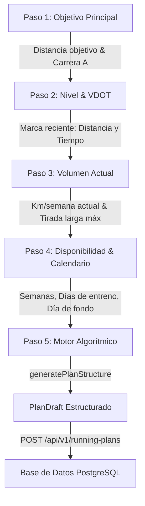
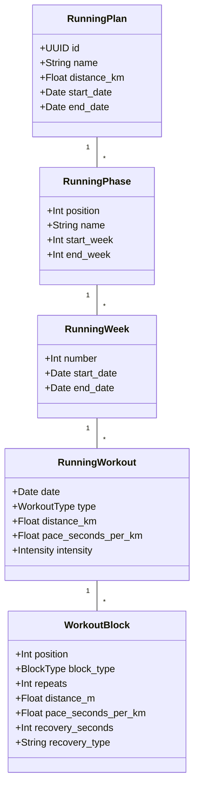
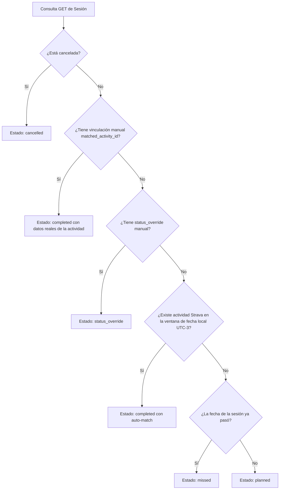

# Informe Técnico: Lógica de Cálculo y Generación de Planes de Entrenamiento en OpenRunning

> **Fecha de generación:** Octubre 2026  
> **Sistema:** OpenRunning Platform  
> **Módulo:** Motor Algorítmico de Planes (`PlanWizard`, `running-math.ts`, `running_plans.py`)

---

## 1. Resumen Ejecutivo

Este informe describe detalladamente la arquitectura de software, las fórmulas fisiológicas y el algoritmo de periodización que utiliza **OpenRunning** para calcular, estructurar y guardar planes de entrenamiento personalizados de running a partir de los datos proporcionados por el atleta.

El sistema transforma la experiencia del corredor (distancia objetivo, marcas recientes, volumen semanal y disponibilidad) en un plan estructurado dividido jerárquicamente en **Fases → Semanas → Sesiones → Bloques de Ejercicio**, con ritmos calculados científicamente mediante las fórmulas de VDOT de **Jack Daniels** y estimaciones de carrera según la fórmula de **Riegel**.

---

## 2. Flujo de Datos y Captura de Inputs (Wizard de Creación)

El proceso se inicia en el frontend a través del componente interactivo [PlanWizard.tsx](file:///home/jose/Documentos/Proyectos/openrunning/frontend/src/components/RunningPlans/PlanWizard.tsx). El atleta completa un onboarding guiado de 5 pasos que recolecta los parámetros base:



### Parametría de Entrada Capturada

| Parámetro | Variable | Descripción / Ejemplo |
| :--- | :--- | :--- |
| **Distancia Objetivo** | `targetKm` | Distancia del plan (5K, 10K, 21.1K Media Maratón, 42.2K Maratón). |
| **Carrera Objetivo** | `race_id` | Identificador UUID de la carrera registrada en el sistema (opcional). |
| **Marca de Referencia** | `refDistanceKm`, `refTimeSeconds` | Mejor marca reciente del corredor (ej. 10K en 48:30 min) para estimar capacidad aeróbica. |
| **Volumen Actual** | `currentWeeklyKm` | Kilometraje semanal habitual del corredor (ej. 35 km/semana). |
| **Fondo Máximo** | `longestRunKm` | Mayor tirada larga completada en el último mes (ej. 14 km). |
| **Duración del Plan** | `numWeeks` | Número total de semanas (típicamente entre 8 y 16 semanas). |
| **Fecha de Inicio** | `start_date` | Fecha ISO de comienzo del entrenamiento. |
| **Inicio de Semana** | `week_start_day` | Día de la semana (1 = Lunes ... 7 = Domingo) para alinear la grilla. |
| **Días Disponibles** | `selectedDays` | Array con los días de la semana habilitados para entrenar. |
| **Día de Tirada Larga**| `longRunDay` | Día específico de la semana reservado para el fondo semanal. |

---

## 3. Lógica Matemática y Fisiológica (`running-math.ts`)

Toda la computación deportiva reside en la librería pura [running-math.ts](file:///home/jose/Documentos/Proyectos/openrunning/frontend/src/lib/running-math.ts).

### 3.1 Cálculo del VDOT (Jack Daniels)

El VDOT es un índice numérico que mide la capacidad aeróbica efectiva del corredor a partir del rendimiento real en carrera.

1. **Velocidad de carrera ($v$):**
   $$v = \frac{D_{ref} \text{ (metros)}}{T_{ref} \text{ (minutos)}}$$

2. **Costo de oxígeno ($VO_2$):**
   $$VO_2 = -4.6 + 0.182258 \cdot v + 0.000104 \cdot v^2$$

3. **Porcentaje de $VO_2 \text{ máx}$ según la duración ($t$ en minutos):**
   $$\%VO_2\text{máx} = 0.8 + 0.1894393 \cdot e^{-0.012778 \cdot t} + 0.2989558 \cdot e^{-0.1932605 \cdot t}$$

4. **Valor VDOT Final:**
   $$VDOT = \frac{VO_2}{\%VO_2\text{máx}}$$

### 3.2 Determinación de Ritmos de Entrenamiento (Paces)

Una vez obtenido el VDOT, se calcula la velocidad exacta en metros/minuto invirtiendo la fórmula cuadrática de costo de oxígeno para cada porcentaje objetivo:

$$0.000104 \cdot v^2 + 0.182258 \cdot v - (4.6 + VDOT \cdot \text{fracción}) = 0$$

Resolviendo para $v$:
$$v = \frac{-0.182258 + \sqrt{0.182258^2 - 4 \cdot 0.000104 \cdot (-(4.6 + VDOT \cdot \text{fracción}))}}{2 \cdot 0.000104}$$

Convertido a ritmo en segundos por kilómetro:
$$\text{Ritmo (s/km)} = \frac{60000}{v}$$

#### Fracciones de VDOT y Zonas de Entrenamiento:

| Tipo de Ritmo | Fracción VDOT | Descripción y Aplicación |
| :--- | :--- | :--- |
| **Easy (Suave)** | `59%` a `74%` | Rodajes aeróbicos en Z2, calentamientos y enfriamientos. |
| **Marathon (Fondo)** | `84%` | Ritmo sostenido para tiradas largas específicas. |
| **Threshold (Tempo)** | `88%` | Ritmo de umbral láctico (sostenible por ~60 min en esfuerzo máximo). |
| **Interval (Velocidad)** | `100%` | Repeticiones cortas/medias (400m-1000m) a $VO_2 \text{ máx}$. |
| **Repetition (Progresiones)**| `105%` | Rectas y progresiones sueltas (*strides*) para economía de carrera. |

### 3.3 Predictor de Carrera (Fórmula de Riegel)

Para establecer el tiempo y ritmo objetivo el día de la carrera final, se aplica la fórmula de Riegel:

$$T_{predicho} = T_{ref} \cdot \left(\frac{D_{target}}{D_{ref}}\right)^{1.06}$$

$$\text{Ritmo Objetivo Carrera (s/km)} = \text{Math.round}\left(\frac{T_{predicho}}{D_{target}}\right)$$

---

## 4. Algoritmo de Periodización y Estructuración (`generatePlanStructure`)

La función `generatePlanStructure` en [PlanWizard.tsx](file:///home/jose/Documentos/Proyectos/openrunning/frontend/src/components/RunningPlans/PlanWizard.tsx#L341-L800) genera automáticamente la jerarquía completa del plan.

### 4.1 División en 4 Fases Semanales

El número total de semanas ($N$) se distribuye dinámicamente en 4 bloques mesocíclicos:

```mermaid
gantt
    title Periodización del Plan de Entrenamiento
    dateFormat X
    axisFormat Sem %s
    section Fases de Entrenamiento
    Fase 1: Base Aeróbica      :active, p1, 1, 4
    Fase 2: Construcción Tempo  :crit, p2, 5, 8
    Fase 3: Pico e Intervalos   :p3, 9, 11
    Fase 4: Tapering y Carrera  :done, p4, 12, 12
```

1. **Fase 1: Base Aeróbica ($\sim 30\%$ de semanas):**
   * **Objetivo:** Adaptación neuromuscular, capilarización y volumen aeróbico Z2.
   * **Sesiones:** Rodajes suaves y progresivos a ritmo Easy.
2. **Fase 2: Construcción & Tempo ($\sim 35\%$ adicionales):**
   * **Objetivo:** Elevación del umbral lactato.
   * **Sesiones:** Sesiones Tempo a ritmo Threshold ($88\% VDOT$) y tiradas largas en progresión.
3. **Fase 3: Pico & Intervalos VO2 ($\sim 20\%$ adicionales):**
   * **Objetivo:** Potencia aeróbica máxima y ritmos específicos.
   * **Sesiones:** Series fraccionadas (ej. $8 \times 800\text{m}$) a ritmo Interval ($100\% VDOT$) y volumen de fondo máximo.
4. **Fase 4: Tapering & Carrera (Semanas finales):**
   * **Objetivo:** Descarga de volumen (reducción del 40%), súper-compensación y día del evento.
   * **Sesiones:** Activación con progresiones cortas y día de la carrera a ritmo objetivo.

### 4.2 Progresión del Volumen de Tirada Larga

En cada semana $w \in [1, N]$, la distancia del fondo largo se calcula en función de la progresión deseada:

$$\text{Progresión} = \frac{w}{N}$$
$$KM_{fondo, w} = \text{Math.min}\left(D_{target} \cdot 0.85, \quad KM_{fondo\_inicial} + \text{Progresión} \cdot (D_{target} \cdot 0.85 - KM_{fondo\_inicial})\right)$$

* En semanas de Tapering (Fase 4), la tirada larga se reduce al $60\%$ de su volumen pico.
* En la última semana ($w = N$), la sesión del día de fondo se reemplaza por el **Día de Carrera Objetivo** ($D_{target}$).

### 4.3 Distribución Inteligente de Días e Intercalado de Descanso

Para prevenir lesiones y favorecer la supercompensación:
* Los días de entrenamiento se ordenan semanalmente alineados a `week_start_day`.
* Los **días de calidad** (Tempo o Intervalos) se ubican al inicio/medio del ciclo semanal.
* El día posterior al entrenamiento de calidad se programa automáticamente como un **Rodaje Regenerativo** (ritmo Easy $+20$ s/km y menor volumen).
* Se generan variaciones de volumen entre rodajes cortos ($5$-$6$ km), medios ($7$-$8$ km) y largos ($9$+ km) para evitar monotonía.

---

## 5. Anatomía Microestructural de los Bloques (`WorkoutBlock`)

Cada sesión (`RunningWorkout`) contiene una lista ordenada de bloques táctiles (`WorkoutBlock`) con objetivos de distancia o tiempo, repeticiones, ritmos objetivos y pausas:



### Ejemplo de Estructura de Bloques para una Sesión de Intervalos ($8 \times 800\text{m}$):

1. **Bloque 1 (`warmup`):** $1500\text{m}$ trote suave a ritmo Easy.
2. **Bloque 2 (`interval`):** Repeticiones: $8 \times 800\text{m}$ a ritmo Interval (ej. $3:55$/km) con $90\text{s}$ de recuperación trotando (`jog`).
3. **Bloque 3 (`cooldown`):** $1500\text{m}$ de afloje libre a ritmo Easy.

---

## 6. Persistencia y Verificación de Cumplimiento en Backend

Una vez confirmado el borrador en el wizard, el plan se envía en un payload anidado al endpoint `POST /api/v1/running-plans/`.

### 6.1 Esquema Relacional (`models.py`)

La estructura se guarda jerárquicamente en PostgreSQL usando SQLModel:
* [RunningPlan](file:///home/jose/Documentos/Proyectos/openrunning/backend/app/models.py#L603): Registro padre con metadata, fechas y vincular opcional a `Race`.
* [RunningPhase](file:///home/jose/Documentos/Proyectos/openrunning/backend/app/models.py#L624): Fases del plan (`start_week` a `end_week`).
* [RunningWeek](file:///home/jose/Documentos/Proyectos/openrunning/backend/app/models.py#L640): Semanas numeradas con sus fechas de inicio/fin.
* [RunningWorkout](file:///home/jose/Documentos/Proyectos/openrunning/backend/app/models.py#L655): Sesión diaria programada con restricción de unicidad `(plan_id, date)`.
* [WorkoutBlock](file:///home/jose/Documentos/Proyectos/openrunning/backend/app/models.py#L689): Pasos microscópicos de la sesión.

### 6.2 Regla de Cumplimiento Dinámico (`running.py`)

El estado de cada sesión (`planned`, `completed`, `missed`, `cancelled`) **no se persiste de forma rígida en la base de datos**, sino que se resuelve dinámicamente en tiempo de lectura mediante la función [resolve_workout_status](file:///home/jose/Documentos/Proyectos/openrunning/backend/app/services/running.py#L48):



---

## 7. Conclusiones y Beneficios de la Arquitectura

1. **Fundamentación Fisiológica Rígida:** Elimina estimaciones arbitrarias al basar los ritmos de cada sesión en el modelo matemático VDOT de Jack Daniels.
2. **Personalización Absoluta:** Se adapta al volumen real, disponibilidad y nivel actual del atleta, garantizando progresiones sostenibles.
3. **Coexistencia Transparente entre Plan y Realidad:** El motor de resolución dinámica detecta automáticamente las carreras registradas manualmente o sincronizadas vía Strava, matcheando la sesión planificada con la ejecución real sin esfuerzo manual.
