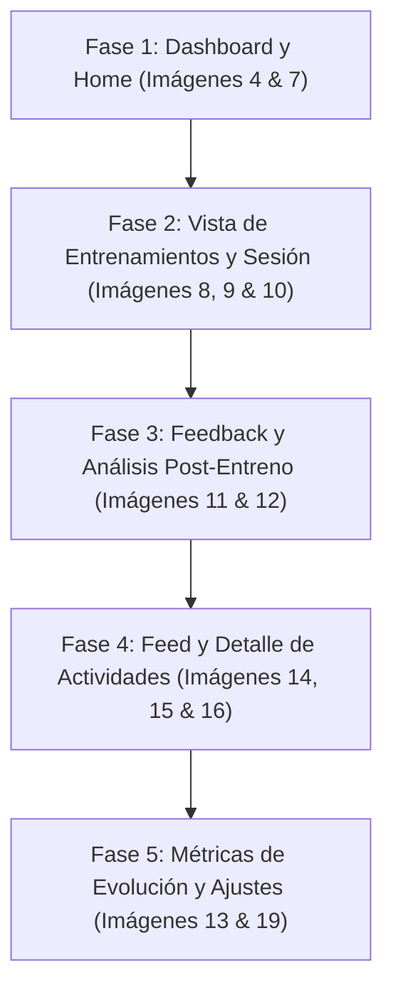

# Plan Maestro de Rediseño UI / UX — OpenRunning

> **Basado en la experiencia de usuario y arquitectura visual de referencia (*Paccer* / `docs/paccer-example/`)**, adaptado a la identidad de alto contraste **Kinetic Volt** de OpenRunning (`#EAFC5F`, fondo oscuro `#000000` / `#09090B`, tarjetas elevadas `#121214` y tipografía técnica y limpia).

---

## 1. Visión y Objetivos

1. **Simplicidad Radical y "Mobile-First / Glanceable":** Reducir la sobrecarga cognitiva. El corredor debe poder abrir la app y entender en menos de 3 segundos: *qué le toca hoy, cómo va su objetivo y cómo estuvo su última salida*.
2. **Jerarquía Guiada por el Contexto:** La pantalla de inicio no debe ser un volcado de estadísticas crudas, sino una narrativa diaria: Carrera Objetivo (Countdown) $\rightarrow$ Progreso Global $\rightarrow$ Entrenamiento de Hoy $\rightarrow$ Feedback.
3. **Flujos Modales y Bottom Sheets Focales:** Sustituir páginas secundarias complejas con hojas deslizables y modales claros para:
   - Vista previa de la carrera objetivo.
   - Detalle de entrenamiento paso a paso y clima.
   - Registro de feedback post-entreno ("¿Cómo te sentiste?").
   - Análisis de entrenamiento inteligente.
4. **Coherencia Visual Sistemática:** Unificar componentes reutilizables (chips de ritmo/velocidad, mini-mapas de polilínea, barras de parciales por km, estados de sincronización).

---

## 2. Auditoría y Mapeo de Pantallas (Paccer vs. OpenRunning)

| Ref. Mockup | Nombre Mockup | Pantalla / Módulo OpenRunning | Objetivo de Rediseño |
| :--- | :--- | :--- | :--- |
| **1, 2, 3** | `1-criar-treino-nivel.png` `2-criar-treino-meta.png` `3-criar-treino-disponibilidade.png` | `routes/_layout/routines/run/new.tsx` `PlanWizard.tsx` | **[COMPLETADO]** Wizard de 3 pasos simple + resumen con activación directa y presets inteligentes. |
| **4, 7** | `4-inicio.png` `7-inicio-prova-alvo.png` | `routes/_layout/index.tsx` (Dashboard / Inicio) | Rediseñar el Dashboard: Hero Card de Carrera Objetivo con cuenta regresiva ("FALTAN X DÍAS"), carrusel de semanas y "Treino de Hoje" con switch Ritmo/Velocidad y modal de meta. |
| **8, 9, 10** | `8-treinos-lista.png` `9-treinos-clima.png` `10-treinos-passo-a-passo.png` | `routes/_layout/routines/run/$planId.tsx` (Vista de Rutina / Calendario de Plan) | Vista de calendario de entrenamientos: selector horizontal de semanas, lista vertical de sesiones con badges de fase, Bottom Sheet de detalles de sesión con pestañas (Resumen, Paso a paso, Clima/Indumentaria) y botón "Exportar a reloj". |
| **11, 12** | `11-treinos-como-foi.png` `12-treinos-analise.png` | `components/Activities/` o Modal de feedback en sesión | Modal post-actividad interactivo: "¿Cómo te sentiste?" con selector de esfuerzo (Débil / Normal / Fuerte) y tarjeta de Análisis Inteligente de sesión (comparación planificado vs real). |
| **13** | `13-treinos-evolucao.png` | `routes/_layout/analytics/index.tsx` o pestaña Evolución en Plan | Pestaña "Evolución": Métricas clave (Realizado vs Planificado, % Aprovechamiento), gráfico de líneas semana a semana de volumen, y tarjeta de Tendencia ("Evolucionando: más rápido con menor FC"). |
| **14, 15** | `14-atividades-mapa.png` `15-atividades-parciais.png` | `routes/_layout/activities/$activityId.tsx` (Detalle de Actividad) | Rediseño de actividad: Mapa limpio con gradiente de ritmo (Verde = rápido, Naranja/Rojo = lento), perfil altimétrico debajo, grid de métricas clave y tabla visual de parciales por km con barras de ritmo. |
| **16** | `16-atividades-lista.png` | `routes/_layout/activities/index.tsx` (Lista de Actividades) | Lista de actividades con pestañas ("Entrenamientos del Plan" vs "Otras actividades"), tarjetas con thumbnail visual de mapa GPS a la izquierda, título, fecha y métricas limpias (Distancia, Ritmo, Duración). |
| **19** | `19-perfil-conexcoes.png` | `routes/_layout/settings.tsx` (Configuración / Perfil) | Sección limpia de Integraciones/Conexiones (Strava, Google Calendar / Relojes) con indicadores de estado claros `[Conectado]` y acción directa "Cambiar entrenamiento actual". |

---

## 3. Plan de Ejecución por Fases

---

### Fase 1: Rediseño del Dashboard Principal (`4-inicio.png` y `7-inicio-prova-alvo.png`)
* **Archivo afectado:** `frontend/src/routes/_layout/index.tsx`
* **Cambios clave:**
  1. **Hero Card "Prueba Objetivo":**
     - Banner superior o miniatura con imagen de fondo sutil del evento.
     - Badge destacado en Kinetic Volt: **"FALTAN X DÍAS"**.
     - Nombre de la carrera y distancia objetivo (`42km`, `21km`, `10km`).
     - Barra de progreso por puntos/semanas (`Semana 1/15` | `Volumen total: 651.8 km`).
     - Al hacer clic en la tarjeta: abrir el Sheet modal (`7-inicio-prova-alvo.png`) con detalles completos (nivel, objetivo de tiempo, fecha límite) y botón "Ver entrenamientos".
  2. **Sección Plegable "Progreso del entrenamiento":**
     - Acordeón que muestra el cumplimiento de la semana actual sin saturar el scroll vertical.
  3. **Tarjeta "Entrenamiento de Hoy" (Glanceable):**
     - Encabezado con temperatura/clima actual (`17°C`).
     - Tipo de entrenamiento destacado: *Corrida Leve*, *Tiro Largo*, etc.
     - Toggle de unidades interactivo: `[PACE (min/km)] | [KM/H]`.
     - Sub-navegación rápida: `[Resumen] [Paso a paso] [Clima]`.

---

### Fase 2: Vista de Calendario de Plan y Detalle de Sesión (`8-treinos-lista.png`, `9-treinos-clima.png`, `10-treinos-passo-a-passo.png`)
* **Archivos afectados:**
  - `frontend/src/routes/_layout/routines/run/$planId.tsx`
  - `frontend/src/components/RunningPlans/PlanDetail.tsx` (o nuevo `TrainingCalendarView.tsx`)
* **Cambios clave:**
  1. **Selector Horizontal de Semanas:**
     - Carrusel horizontal con chips circulares para cada semana (`1`, `2`, ..., `10`, etc.).
     - Indicador visual especial para la semana actual (puntero/flecha y color amarillo).
  2. **Tarjetas de Sesión Semanal:**
     - Badge lateral de color por tipo/intensidad de sesión (Verde para regenerativo, Amarillo para umbral/tempo, Rojo para series).
     - Datos resumidos: Día de la semana + número de día, Nombre de la sesión, Distancia total, Rango de ritmo previsto (`4:35 - 4:45 min/km`) y pronóstico del tiempo estimado para ese día.
     - Indicador de estado de completitud (círculo gris pendiente / check verde si ya fue completado).
  3. **Bottom Sheet / Drawer Detalle de Sesión:**
     - **Pestaña Resumen:** Métricas globales (Distancia, Ritmo medio, Zona FC recomendada p.ej. Z2 o Z4).
     - **Pestaña Paso a Paso (`10-treinos-passo-a-passo.png`):**
       - Bloques verticales ordenados con barra lateral:
         - Calentamiento: *2km suave*
         - Bloque Principal: *8x 200m con 2 min de descanso*
         - Enfriamiento: *2km suave*
       - Botón destacado: **"Descargar entrenamiento para el reloj (.FIT / Garmin)"**.
     - **Pestaña Clima & Equipamiento (`9-treinos-clima.png`):**
       - Temperatura mín/máx, probabilidad de lluvia, humedad y viento.
       - Cuadro "Cuidados especiales" (consejos de hidratación o temperatura).
       - Recomendación de indumentaria (*Remera técnica*, *Short*, *Gorra / Lentes*).

---

### Fase 3: Registro de Sensaciones y Análisis de IA (`11-treinos-como-foi.png`, `12-treinos-analise.png`)
* **Archivos afectados:**
  - `frontend/src/components/Activities/WorkoutFeedbackModal.tsx` (nuevo componente)
  - Integración en `activities/$activityId.tsx` y en el cierre de entrenamientos del plan.
* **Cambios clave:**
  1. **Modal "¿Cómo fue tu entrenamiento?":**
     - Grid de 4 inputs de confirmación de métricas:
       - Distancia (`5.00 km`)
       - Ritmo medio (`05:50 min/km`)
       - Duración (`00:29:10`)
       - Frecuencia cardíaca media (`148 bpm`)
     - Selector de esfuerzo percibido (RPE / Smiley icons):
       - `[☹ Débil / Mal]`
       - `[😐 Normal / Adecuado]`
       - `[😊 Fuerte / Óptimo]`
     - Botón principal de acción: **"Registrar entrenamiento"**.
  2. **Pestaña / Tarjeta "Análisis Inteligente del Entrenamiento":**
     - Comparación automática entre lo prescrito por el plan y lo ejecutado en la actividad Strava/Garmin.
     - Insights automatizados:
       - Ejemplo: *"Completaste la distancia propuesta, sin embargo el ritmo y la frecuencia cardíaca estuvieron por encima de lo planificado para un entreno regenerativo. Mantén la intensidad bajo control en las próximas sesiones para optimizar la recuperación muscular."*

---

### Fase 4: Historial de Actividades y Vista de Detalle (`14-atividades-mapa.png`, `15-atividades-parciais.png`, `16-atividades-lista.png`)
* **Archivos afectados:**
  - `frontend/src/routes/_layout/activities/index.tsx`
  - `frontend/src/routes/_layout/activities/$activityId.tsx`
  - `frontend/src/components/Activities/ActivityMap.tsx`
* **Cambios clave:**
  1. **Feed de Actividades (`16-atividades-lista.png`):**
     - Pestañas superiores: `[Entrenamientos del Plan (X)]` y `[Otras actividades (Y)]`.
     - Tarjeta horizontal: Mapa en miniatura a la izquierda (con la ruta dibujada en color de acento), título editable, fecha y hora, y columnas compactas: Distancia, Ritmo, Duración.
  2. **Detalle de Actividad (`14-atividades-mapa.png`):**
     - Mapa interactivo a pantalla superior completa con trazado coloreado por velocidad/ritmo (Escala degradada: Verde = rápido, Amarillo = medio, Rojo = lento) con marcas de cada kilómetro.
     - Gráfico de perfil de elevación sincronizado con el cursor del mapa.
     - Grid de datos: Distancia, Ritmo medio, FC media, Duración, Altimetría acumulada, Calorías, Deporte, Dispositivo registrado (p.ej. Garmin Forerunner).
  3. **Tabla de Parciales por Kilómetro (`15-atividades-parciais.png`):**
     - Vista clara km por km con barra visual de ritmo en amarillo/volt y desnivel neto por tramo.

---

### Fase 5: Evolución Global y Ajustes de Perfil (`13-treinos-evolucao.png`, `19-perfil-conexcoes.png`)
* **Archivos afectados:**
  - `frontend/src/routes/_layout/analytics/index.tsx`
  - `frontend/src/routes/_layout/settings.tsx`
* **Cambios clave:**
  1. **Pantalla "Evolución":**
     - Cabecera con 3 métricas de resumen: `Realizado (km)`, `Planificado (km)`, `% Aprovechamiento / Adherencia`.
     - Gráfico comparativo de líneas: Curva continua amarilla (Realizado) vs. Curva discontinua gris (Planificado) por cada semana del plan.
     - Tarjeta de tendencia de rendimiento: Ritmo medio del ciclo vs. FC media, con tag de estado (*"Evolucionando: Estás corriendo más rápido con menor esfuerzo cardíaco"*).
  2. **Perfil y Conexiones (`19-perfil-conexcoes.png`):**
     - Tarjetas de servicio limpias para Strava y Google Calendar / Garmin Connect.
     - Estado visible `✓ Conectado` con botón directo `Desconectar`.
     - Acceso rápido a gestión de ciclo: **"Cambiar entrenamiento actual"** (redefinir objetivos o crear nuevo plan sin perder el histórico).

---

## 4. Guía de Componentes y Tokens de Diseño (Kinetic Volt + Paccer Layout)

| Elemento | Token / Estilo Paccer Adaptado | Tailwind Utility |
| :--- | :--- | :--- |
| **Color de Acento** | Amarillo Volt de alto contraste | `bg-[#EAFC5F]` / `text-[#09090B]` |
| **Fondos de Pantalla** | Fondo oscuro mate | `bg-[#09090B]` / `bg-[#000000]` |
| **Superficie de Tarjetas** | Contenedor elevado con borde sutil | `bg-[#121214] border border-[#27272A] rounded-2xl` |
| **Tipografía de Títulos** | Bold deportivo e impactante | `font-bold tracking-tight text-white` |
| **Badges de Countdown** | Pastilla amarilla vibrante | `bg-[#EAFC5F] text-black font-extrabold rounded-xl px-3 py-2 text-center` |
| **Separadores de Bloque** | Borde vertical izquierdo coloreado | `border-l-4 rounded-l-sm pl-3` |
| **Navegación Inferior (Tabs)** | 5 pestañas fijas con iconos limpios | `Inicio` (Home), `Actividades` (Shoe/Run), `Entrenamientos` (Calendar), `Desafíos` (Zap), `Perfil` (User) |

---

## 5. Criterios de Aceptación y Pruebas
1. **Responsive & Mobile Usability:** Todos los componentes deben ser cómodamente clickeables en pantallas táctiles (mínimo 44px de tap target).
2. **Consistencia de Datos:** Todos los cálculos matemáticos (VDOT, ritmos proyectados, zonas de frecuencia cardíaca) continúan usando la biblioteca probada `running-math.ts`.
3. **Preservación de Pruebas:** Todos los tests de Vitest existentes deben continuar pasando sin regresiones tras cada fase completada.
